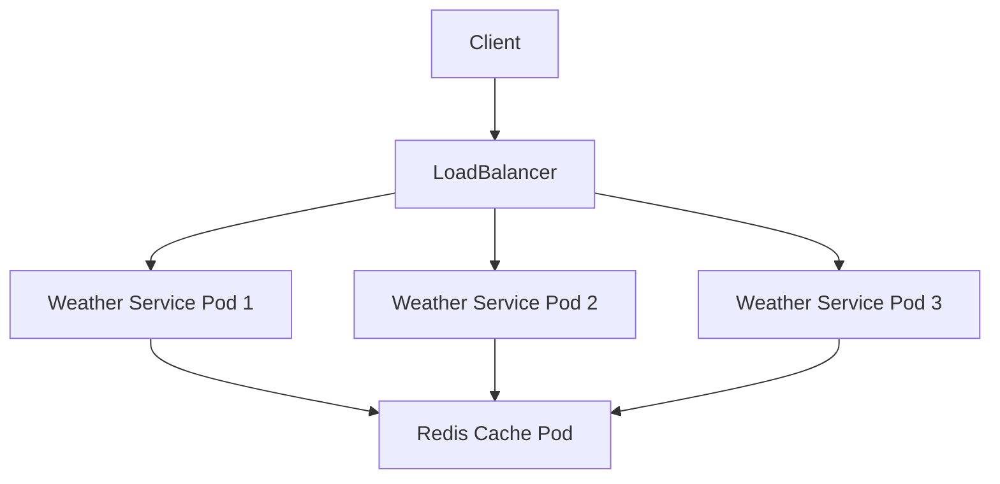

# Weather Dashboard with Redis Cache

A learning experiment to understand containerization, microservices, and Kubernetes orchestration. This project implements a weather service with Redis caching to explore cloud-native development practices.

## Overview

This project serves as a hands-on learning experience for:
- Containerization with Docker
- Kubernetes deployment and orchestration
- Microservices architecture
- Caching strategies with Redis
- Go API development
- Infrastructure as Code

## Technologies Used

### Core Technologies
- **Go (Golang)**: Backend API development
- **Redis**: Caching layer
- **Docker**: Containerization
- **Kubernetes**: Container orchestration

### Libraries and Frameworks
- `gorilla/mux`: HTTP routing
- `go-redis/redis`: Redis client for Go
- `minikube`: Local Kubernetes development

### Tools and Services
- Docker Hub: Container registry
- kubectl: Kubernetes CLI tool
- Bash scripting: Deployment automation
- Visual Studio Code: Development environment

## Architecture



## Features
- RESTful API for weather information
- Redis caching with TTL
- Horizontal scaling with Kubernetes
- Health check endpoints
- Environment-based configuration
- Automated deployment process

## Prerequisites
- Go 1.21 or higher
- Docker
- Kubernetes cluster (or Minikube)
- kubectl configured
- Redis

## Quick Start

1. Clone the repository
```bash
git clone https://github.com/yourusername/weather-dashboard.git
cd weather-dashboard
```

2. Create .env file
```bash
WEATHER_API_KEY=your_api_key
REDIS_HOST=localhost
REDIS_PORT=6379
PORT=8080
```

3. Deploy to Kubernetes
```bash
chmod +x deploy.sh
./deploy.sh
```

4. Test the service
```bash
# Get service URL
minikube service weather-service --url

# Test endpoints
curl http://<service-url>/api/weather/london
curl http://<service-url>/api/health
curl http://<service-url>/api/cache/stats
```

## API Endpoints

- `GET /api/weather/{location}`: Get weather for a location
- `GET /api/health`: Health check endpoint
- `GET /api/cache/stats`: Redis cache statistics
- `GET /api/cache`: List cached keys

## Development Notes

This project was created as a learning experience to understand:
- How to structure a Go microservice
- Implementing caching strategies
- Kubernetes deployment patterns
- Container orchestration practices
- DevOps automation

Key learning outcomes:
1. Understanding pod lifecycles
2. Service discovery in Kubernetes
3. Container networking
4. Resource management and scaling
5. Environment configuration
6. Deployment automation

## Acknowledgments
- Kubernetes documentation
- Go community
- Redis documentation
- Docker tutorials
- Anthropic

## Contact

Created by Jonathan Leahy - feel free to contact me!
